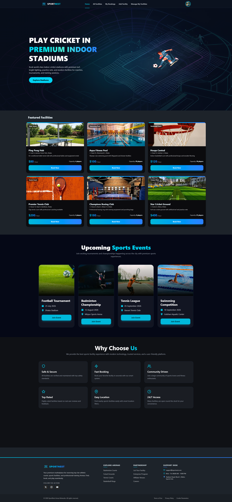
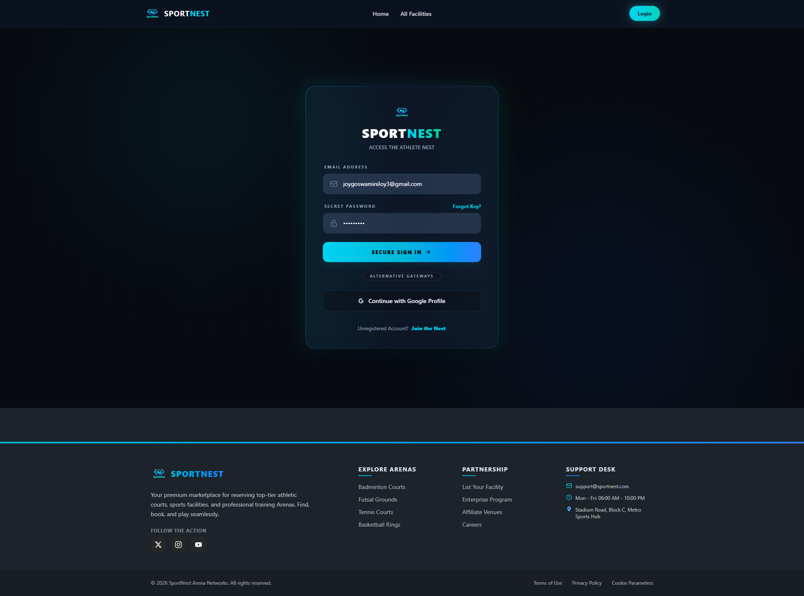
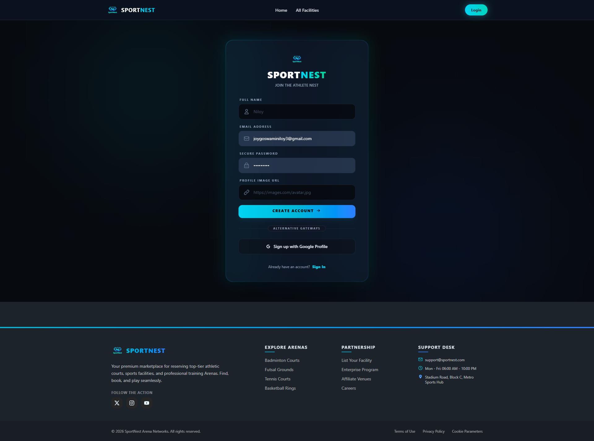
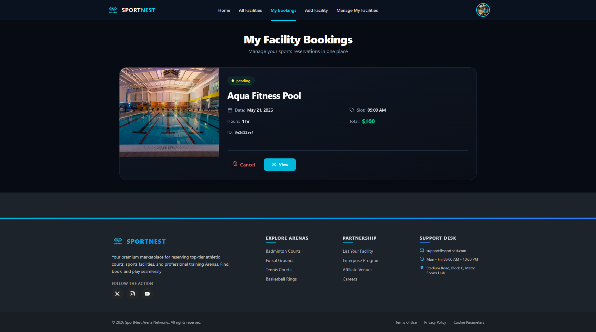
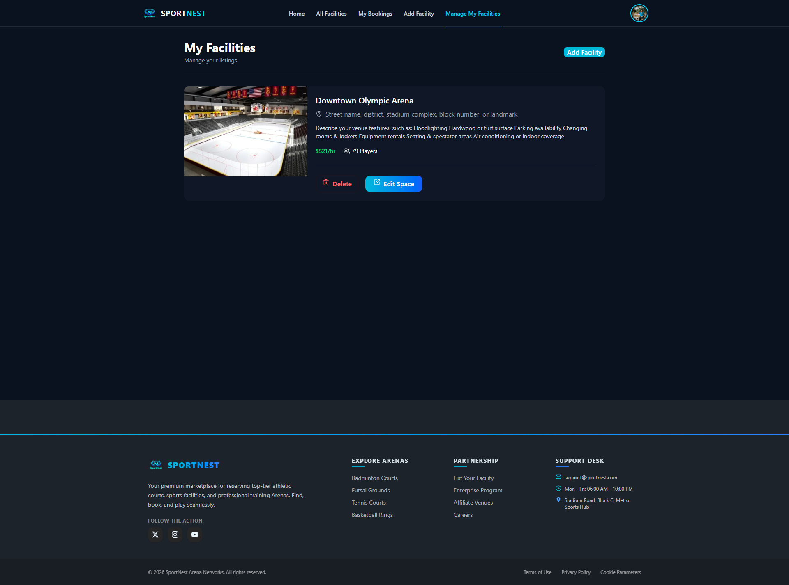
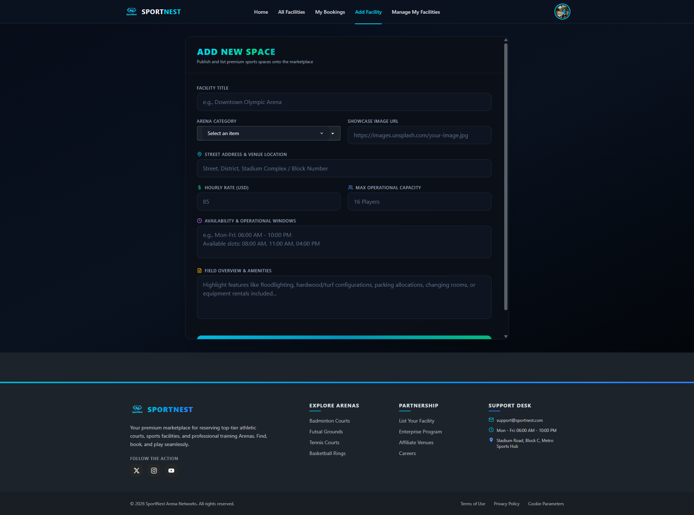

# 🏟️ SportNest — Premium Sports Facility Booking Management Platform

[](https://nextjs.org/)
[](https://tailwindcss.com/)
[](https://sportnest-puce.vercel.app/)

SportNest is an enterprise-grade, high-performance web application designed for reserving top-tier athletic courts, sports facilities, and professional training arenas. Engineered with a utility-first modular structure, this platform offers role-based access flows (Athletes vs. Facility Managers), fluid asynchronous state management, and an immersive, pixel-perfect dark UI.

---

## 🔗 Live Deployments

* **🖥️ Client Live URL:** [https://sportnest-puce.vercel.app](https://sportnest-puce.vercel.app/)
* **⚙️ Production API Server:** [https://sportnest-server.vercel.app](https://sportnest-puce.vercel.app/) *(Fallback or dynamic domain configured)*

---

## 📸 Production UI Architecture

### 🏠 Hub & Discovery


### 🔐 Identity & Authentication Gateways
| Secure Sign In | Athlete Registration |
| :---: | :---: |
|  |  |

### 📅 Booking Engine & Ledger
| Marketplace (All Arenas) | Real-time Booking Status Ledger |
| :---: | :---: |
|  |  |

### 🛠️ Vendor Operations Control Center
| Inventory Analytics (My Listings) | Multi-Field Provisioning Form |
| :---: | :---: |
|  |  |

---

## ⚡ Key Advanced Engineering Features

* **🔐 Unified Authentication Workflow:** Secure Login, Sign Up, and one-click Google OAuth profile integration utilizing dynamic token propagation to ensure persistent, safe sessions.
* **🧭 Dynamic Navigation Context:** Smart navigation architectures that dynamically alter layouts, page listings, and profile states seamlessly depending on active authentication status.
* **🔎 Premium Discovery Engine:** Advanced, real-time client-side search indexing and venue categorizations paired with responsive grid layouts highlighting hourly rates, local addresses, and capacity limitations.
* **📅 Reservation Pipeline:** Simplified transactional workflows to lock slots for premium spaces (e.g., *Aqua Fitness Pool*) complete with absolute status badges (`pending`, `confirmed`) and individual Booking ID hash referencing.
* **💼 Facility Owner Control Center:** Dedicated manager-level dashboard tabs enabling users to effortlessly execute standard CRUD mutations: add new facilities, inspect current active spaces, edit room options, or permanently erase listings.
* **🎨 Ultra-Premium Dark Interface:** Built with a rich dark aesthetic accented with glowing glassmorphism borders (`#00D2FF`, `#0072F5`) keeping it completely optimized across Mobile, Tablet, and Desktop display frames.
* **⚡ Modern UX Resiliency:** Implements structural async loading templates, micro-animations, and instant event response messages powered by centralized toast messaging.

---

## 🛠️ Tech Stack & Dependencies

### **Core Architecture**
* **Next.js & React.js** – Full-stack framework leveraging modern component lifecycle hooks and performance-first routing strategies.

### **Design System & Component Styling**
* **Tailwind CSS** – Utility-first structural engine for highly maintainable layout design classes.
* **DaisyUI & HeroUI (`@heroui/react`)** – Premium accessible component structures optimized perfectly for dark layouts.
* **Framer Motion** – GPU-accelerated declarative micro-interactions and smooth page transitions.
* **React Icons** – Vector icon support across all contextual menus, inputs, and footer layouts.

### **Utility Handlers**
* **React Toastify** – Instant user alert notifications synchronizing input validation cycles and asynchronous state status.

---

## 📦 Dependency Manifest

```json
{
  "name": "sportnest-client",
  "version": "1.0.0",
  "private": true,
  "scripts": {
    "dev": "next dev",
    "build": "next build",
    "start": "next start",
    "lint": "next lint"
  },
  "dependencies": {
    "@heroui/react": "latest",
    "daisyui": "latest",
    "framer-motion": "latest",
    "next": "latest",
    "react": "latest",
    "react-dom": "latest",
    "react-icons": "latest",
    "react-toastify": "latest",
    "tailwindcss": "latest"
  }
}
